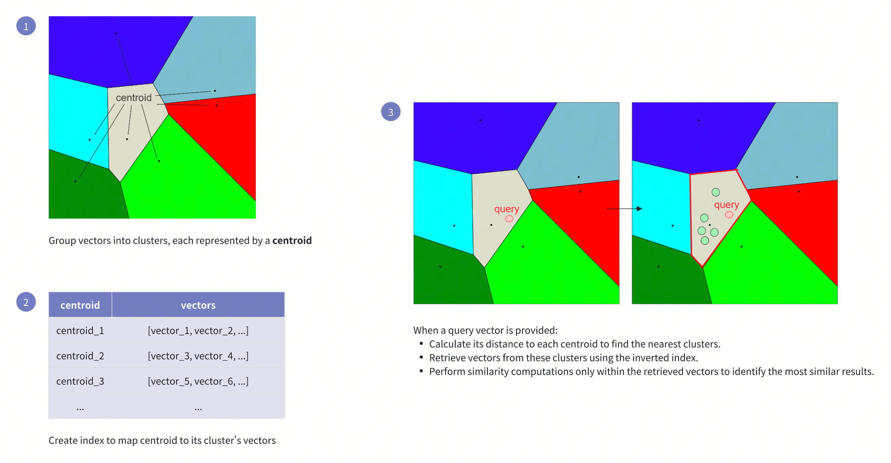
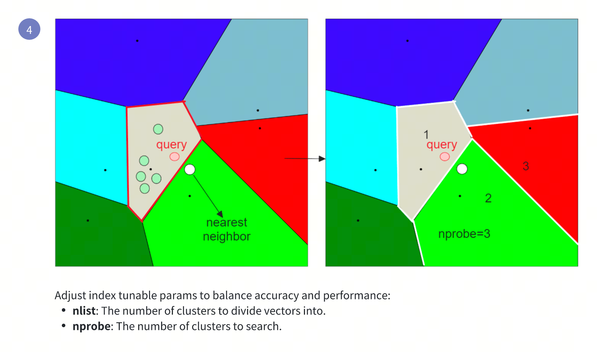

# IVF_FLAT

The **IVF_FLAT** index is an indexing algorithm that can improve search performance for floating-point vectors.

This index type is ideal for large-scale datasets that require fast query responses and high accuracy, especially when clustering your dataset can reduce the search space and sufficient memory is available to store cluster data.

## Overview

The term **IVF_FLAT** stands for **Inverted File Flat**, which encapsulates its dual-layered approach to indexing and searching for floating-point vectors:

- **Inverted File (IVF):** Refers to clustering the vector space into manageable regions using [k-means clustering](https://en.wikipedia.org/wiki/K-means_clustering). Each cluster is represented by a **centroid**, serving as a reference point for the vectors within.
- **Flat:** Indicates that within each cluster, vectors are stored in their original form (flat structure), without any compression or quantization, for precise distance computations.

The following figure shows how it works:



This indexing method speeds up the search process, but it comes with a potential drawback: the candidate found as the nearest to the query embedding may not be the exact nearest one. This can happen if the nearest embedding to the query embedding resides in a cluster different from the one selected based on the nearest centroid (see visualization below).

To address this issue, **IVF_FLAT** provides two hyperparameters that we can tune:

- `nlist`: Specifies the number of partitions to create using the k-means algorithm.
- `nprobe`: Specifies the number of partitions to consider during the search for candidates.

Now if we set `nprobe` to 3 instead of 1, we get the following result:



By increasing the `nprobe` value, you can include more partitions in the search, which can help ensure that the nearest embedding to the query is not missed, even if it resides in a different partition. However, this comes at the cost of increased search time, as more candidates need to be evaluated. For more information on index parameter tuning, refer to [Index params](#index-params).

## Build index

To build an `IVF_FLAT` index on a vector field in Milvus, use the `add_index()` method, specifying the `index_type`, `metric_type`, and additional parameters for the index.

```python
from pymilvus import MilvusClient

# Prepare index building params
index_params = MilvusClient.prepare_index_params()

index_params.add_index(
    field_name="your_vector_field_name", # Name of the vector field to be indexed
    index_type="IVF_FLAT", # Type of the index to create
    index_name="vector_index", # Name of the index to create
    metric_type="L2", # Metric type used to measure similarity
    params={
        "nlist": 64, # Number of clusters for the index
    } # Index building params
)

```

In this configuration:

- `index_type`: The type of index to be built. In this example, set the value to `IVF_FLAT`.
- `metric_type`: The method used to calculate the distance between vectors. Supported values include `COSINE`, `L2`, and `IP`. For details, refer to [Metric Types](metric.md).
- `params`: Additional configuration options for building the index.
    - `nlist`: Number of clusters to divide the dataset.
    
    To learn more building parameters available for the `IVF_FLAT` index, refer to [Index building params](#Index-building-params).
    

Once the index parameters are configured, you can create the index by using the `create_index()` method directly or passing the index params in the `create_collection` method. For details, refer to [Create Collection](create-collection.md).

## Search on index

Once the index is built and entities are inserted, you can perform similarity searches on the index.

```python
search_params = {
    "params": {
        "nprobe": 10, # Number of clusters to search
    }
}

res = MilvusClient.search(
    collection_name="your_collection_name", # Collection name
    data=[[0.1, 0.2, 0.3, 0.4, 0.5]],  # Query vector
    limit=3,  # TopK results to return
    search_params=search_params
)

```

In this configuration:

- `params`: Additional configuration options for searching on the index.
    - `nprobe`: Number of clusters to search for.
    
    To learn more search parameters available for the `IVF_FLAT` index, refer to [Index-specific search params](#index-specific-search-params).
    

## Index params

This section provides an overview of the parameters used for building an index and performing searches on the index.

### Index building params

The following table lists the parameters that can be configured in `params` when [building an index](#Build-index).

| **Parameter** | **Description** | **Value Range** | **Tuning Suggestion** |
| --- | --- | --- | --- |
| `nlist` | The number of clusters to create using the k-means algorithm during index building.Each cluster, represented by a centroid, stores a list of vectors. Increasing this parameter reduces the number of vectors in each cluster, creating smaller, more focused partitions. | **Type**: Integer<br>**Range**: [1, 65536]<br>**Default value**: `128` | Larger `nlist` values improve recall by creating more refined clusters but increase index building time. Optimize based on dataset size and available resources.In most cases, we recommend you set a value within this range: [32, 4096]. |

### Index-specific search params

The following table lists the parameters that can be configured in `search_params.params` when [searching on the index](#Search-on-index).

| **Parameter** | **Description**                                                                                                                                                                              | **Value Range**                                                | **Tuning Suggestion**                                                                                                                                                                                              |
|---------------|----------------------------------------------------------------------------------------------------------------------------------------------------------------------------------------------|----------------------------------------------------------------|--------------------------------------------------------------------------------------------------------------------------------------------------------------------------------------------------------------------|
| `nprobe`      | The number of clusters to search for candidates.Higher values allow more clusters to be searched, improving recall by expanding the search scope but at the cost of increased query latency. | **Type**: Integer<br>**Range**: [1, *nlist*]<br>**Default value**: `8` | Increasing this value improves recall but may slow down the search.Set `nprobe` proportionally to `nlist` to balance speed and accuracy.<br>In most cases, we recommend you set a value within this range: [1, nlist]. |
